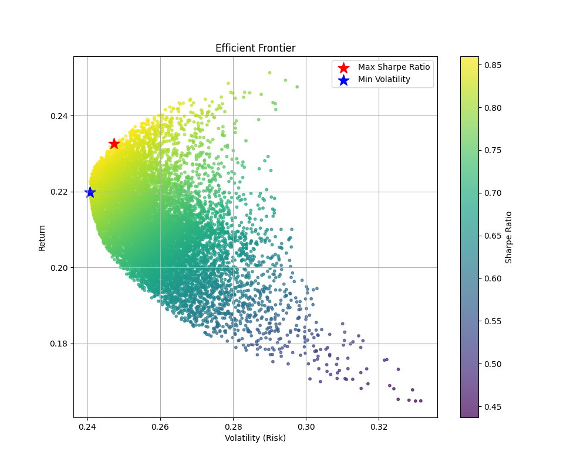

# Portfolio Optimization Project

This project applies **Modern Portfolio Theory (MPT)** to optimize a portfolio of financial assets. Using Python, the analysis identifies portfolios that maximize returns for a given level of risk or minimize risk for a given level of return. The findings are visualized using an **Efficient Frontier**, with optimal portfolios highlighted.

## Features
- Calculate risk metrics:
  - **Annual Returns**
  - **Volatility**
  - **Sharpe Ratio**
- Generate and visualize the **Efficient Frontier**.
- Identify key portfolios:
  - **Maximum Sharpe Ratio Portfolio**: Highest risk-adjusted return.
  - **Minimum Volatility Portfolio**: Lowest overall risk.

## Dataset
- **Source**: Historical stock price data from Yahoo Finance, retrieved using the `yfinance` library.
- **Assets Analyzed**: AAPL, MSFT, GOOG, AMZN.
- **Timeframe**: From January 1, 2021, to December 12, 2024.

## Installation
1. Clone this repository:
   ```bash
   git clone https://github.com/Sharan300703/portfolio-optimization-project.git
   ```
2. Install required Python libraries:
   ```bash
   pip install -r requirements.txt
   ```

## Usage
Open the Jupyter Notebook in the `notebooks/` directory to explore the analysis step-by-step.

## Results
- **Efficient Frontier**:
  

- **Optimal Portfolio Metrics**:
  | Portfolio                  | Expected Return | Volatility (Risk) | Sharpe Ratio |
  |----------------------------|-----------------|-------------------|--------------|
  | Maximum Sharpe Ratio       |     23.32%      |      24.79%       |     0.86     |
  | Minimum Volatility         |     21.99%      |      24.07%       |     0.83     |

- **Portfolio Allocations**:
  - **Maximum Sharpe Ratio Portfolio**:
      -  AAPL – 20.1%
      -  AMZN – 0.096%
      -  GOOG – 35.3%
      -  MSFT – 44.5%

  - **Minimum Volatility Portfolio**:
      -  AAPL – 43.2%
      -  AMZN – 0.270%
      -  GOOG – 8.41%
      -  MSFT – 48.1%


## Key Insights
- Diversification reduces risk by including assets with low or negative correlations.
- The **Maximum Sharpe Ratio Portfolio** is ideal for investors seeking high risk-adjusted returns.
- The **Minimum Volatility Portfolio** is suited for risk-averse investors.

## Future Work
- Implement **backtesting** to validate portfolio performance with out-of-sample data.
- Add **constraints** (e.g., sector caps, no short-selling) for realistic scenarios.
- Explore **machine learning** to predict asset returns or volatility.

## Full Report
[View Full Report](Portfolio_Optimization_Report.pdf)
